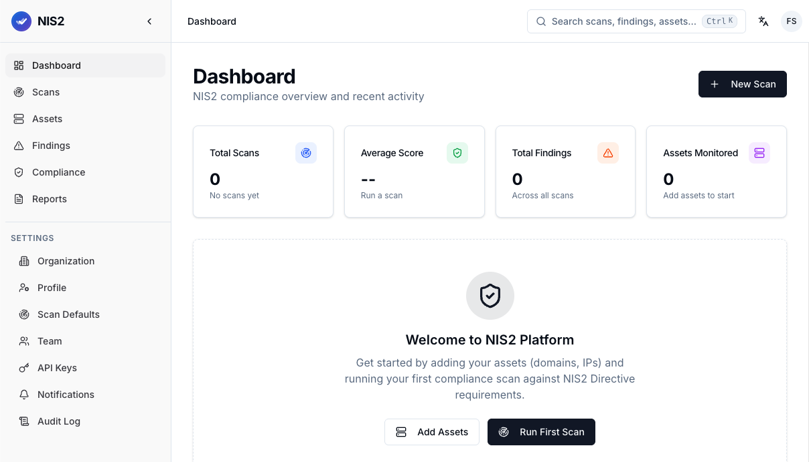

<p align="center">
  
  <br />
  
  
  
  
</p>

<p align="center">
  
</p>

# NIS2 Continuous Posture Management and Remediation Platform

Open-source platform for **NIS2 Directive (EU 2022/2555) continuous posture management**. Governance framework, technical validation engine, remediation playbooks, incident response workflows, and supply chain risk management.

Designed for self-hosted, on-premise deployment. Your scan data, asset inventory, and vulnerability reports never leave your infrastructure.

> For CISO, DPO, NIS2 consultants, and IT teams bridging the gap between compliance documentation and operational execution.

---

## What this platform is (and is not)

This is **not** a scanner that calls itself a compliance platform. It's a GRC layer with an integrated technical validation engine. It does **not** replace a CISO, an internal audit programme, or a real legal review of your D.Lgs 138/2024 obligations.

| Layer | What it does |
|-------|--------------|
| **Governance Framework** | 30-item checklist cross-referenced to NIS2 Art. 21 sub-paragraphs, document tracking, owner assignment |
| **Remediation and Execution Control** | Structured playbooks, optional AI copilot (Ollama/OpenAI), open/acknowledged/resolved workflow |
| **Technical Validation Engine** | 30+ automated checks (TLS, DNS, ports, certificates, headers, secrets) — the probe that verifies if the network reflects the policy |

The scanner is the technical probe. The governance framework is where the substantive NIS2 work lives — and most of it is human work, not automation.

---

## NIS2 Directive coverage

### Art. 21 — Risk management measures

The compliance matrix references all ten sub-paragraphs (a) through (j). Several of them — by design of the directive itself — cannot be evaluated by an automated scanner and are tracked through the governance checklist (status: *manual verification required*). What the platform automates vs. what stays manual:

| Sub-paragraph | Scope | How the platform supports it |
|---------------|-------|------------------------------|
| (a) Risk analysis policies | Methodology, periodic updates | Governance checklist (manual) |
| (b) Incident handling | Detection, response, CSIRT notification | Incident module + Art. 23 lifecycle |
| (c) Business continuity | BCP, DRP, backup, periodic testing | BIA module (RTO/RPO/MTPD) |
| (d) Supply chain security | Vendor assessment, contracts, monitoring | Vendor Risk module (Art. 18) |
| (e) Secure acquisition and development | SDLC, code review, vulnerability management | Governance checklist (manual) |
| (f) Effectiveness assessment | Internal audits, KPIs, penetration testing | Technical validation engine + checklist |
| (g) Cyber hygiene and training | Awareness, phishing simulation | Governance checklist (manual) |
| (h) Cryptography | Crypto policy, key management | Technical validation (TLS/cert) + checklist |
| (i) Human resources security | Onboarding/offboarding, screening, PAM | Governance checklist (manual) |
| (j) Authentication and access control | MFA, RBAC, PAM, SSO, access logging | Governance checklist (manual) |

### Art. 23 — Incident reporting (CSIRT)

Incident lifecycle aligned with the legal deadlines:

| Phase | Deadline | Platform support |
|-------|----------|------------------|
| Early Warning | 24 hours | "Red Button" — generates a CSIRT-ready Early Warning JSON from 3 fields plus the latest asset inventory |
| Incident Notification | 72 hours | Structured form with taxonomy, IOCs, timeline |
| Final Report | 1 month | Aggregated data, impact assessment, lessons learned |

> Note: The platform produces the artefacts and tracks the deadlines. **Submission to CSIRT Italia is a manual step** through `csirt.gov.it`. There is no automated push.

### Art. 18 — Supply chain (Vendor Risk Management)

| Feature | Status |
|---------|--------|
| Vendor inventory with criticality classification (1-4) | Implemented |
| Security assessment scoring (0-100) | Implemented |
| Contract tracking (SLA, audit rights, security clauses) | Implemented |
| Geographic location and data access level | Implemented |
| Certification tracking (ISO 27001, SOC2, CSA STAR) | Implemented |
| ACN Art. 18 relevance flagging (Italy) | Implemented |

### Business Impact Analysis (BIA)

| Feature | Status |
|---------|--------|
| Business process inventory with criticality levels | Implemented |
| RTO/RPO/MTPD definition per process | Implemented |
| 5-dimension impact scoring (financial, operational, reputational, regulatory, safety) | Implemented |
| Asset and vendor dependency mapping | Implemented |
| BCP/DRP gap detection | Implemented |
| Impact matrix with automatic gap identification | Implemented |

---

## National transposition modules

The NIS2 Directive requires each EU member state to transpose it into national law. This platform provides a reference implementation for Italy, extensible to other jurisdictions.

### Italy: D.Lgs 138/2024 + Determine ACN

| Reference | Coverage |
|-----------|----------|
| D.Lgs 138/2024 (Italian NIS2 transposition) | Art. 21 cross-reference in the governance checklist |
| Determina ACN 127434/2026 | Technical baseline references in the compliance matrix |
| Determina ACN 127437/2026 | Art. 18 vendor inventory with ACN-specific fields |
| ACN BIA template | Internal model in place; alignment to the official ACN model pending publication |
| Compliance deadlines API | Real countdowns: CSIRT referent (Dec 2026), 24h notification (Jan 2027), baseline measures (Jul 2027) |
| ACN-compatible JSON export | `/api/v1/acn-export/art18` and `/api/v1/acn-export/bia` |

> **ACN export — preliminary schema.** The official *modello di categorizzazione* announced by ACN (publication expected May/June 2026 per the Tavolo NIS) has not been released yet. The current export is a best-effort structural mapping based on Determina 127437/2026; field names and shape will be re-validated and may change once the official template is published.

### Other EU member states (extensible)

The governance checklist maps to NIS2 Art. 21 at the EU level. National-specific modules (like the Italian ACN module) can be added for ANSSI (France), BSI (Germany), CCN-CERT (Spain) and others — contributions welcome.

---

## Deployment: designed for on-premise

> A CISO of an essential entity will not upload their vulnerability data to a third-party cloud. This platform is designed to run inside your perimeter.

```bash
git clone https://github.com/fabriziosalmi/nis2-public.git
cd nis2-public
cp .env.example .env    # Generate real secrets — see comments inside
make prod               # Production: Caddy auto-HTTPS + all services

# Or development:
make dev                # http://localhost:8077 (UI) + http://localhost:8000/docs (API)
```

All data stays in your PostgreSQL instance. No telemetry, no external calls, no cloud dependencies.

For air-gapped environments: Ollama AI copilot runs entirely local.

---

## Technical validation engine (30+ checks)

These automated checks verify whether the security measures documented in your governance framework are actually implemented on the network:

| Category | Checks |
|----------|--------|
| **Certificates** | Chain validation, CT log monitoring (crt.sh), OCSP, key strength (RSA/ECDSA), SAN coverage, expiry prediction, health scoring 0-100 |
| **TLS/SSL** | Protocol versions, cipher suites, weak protocols, HSTS enforcement |
| **DNS security** | DNSSEC, SPF, DMARC, DKIM, zone transfer protection, MX redundancy |
| **HTTP headers** | CSP, X-Frame-Options, cookie flags, SRI, security.txt |
| **Port exposure** | 14 critical ports (SSH, RDP, SMB, MySQL, PostgreSQL, Redis, MongoDB) |
| **Resilience** | WAF/CDN detection, version disclosure, SSH hardening |
| **Secrets** | AWS keys, GitHub tokens, private keys, JWT in responses |

### EU Privacy / GDPR Posture (separate from NIS2)

> These checks verify GDPR / ePrivacy / Consumer Code requirements. They are **not** NIS2 controls and are clearly labelled as such in all reports — never aggregated into the NIS2 score.

- P.IVA (Italian commercial website requirement)
- Privacy policy detection
- Cookie banner compliance (via Playwright)

---

## API surface

| Router | Endpoints | Purpose |
|--------|-----------|---------|
| `/api/v1/auth` | 10 | JWT authentication, registration, change-password, forgot/reset password, **switch active organization** |
| `/api/v1/scans` | 8 | Scan management, results, comparison. Read endpoints accept API-key Bearer auth |
| `/api/v1/findings` | 5 | Finding lifecycle (open/acknowledged/resolved). Read endpoints accept API-key Bearer auth |
| `/api/v1/assets` | 6 | Asset inventory management. Read endpoints accept API-key Bearer auth |
| `/api/v1/api-keys` | 3 | Long-lived `nis2_*` Bearer tokens for CI/CD pipelines (raw value shown once) |
| `/api/v1/audit-logs` | 1 | Read-only org-scoped audit trail (90-day retention) |
| `/api/v1/organizations` | 8 | Org settings, members, role management, **self-serve org creation** |
| `/api/v1/vendors` | 5 | Vendor risk management (Art. 18) |
| `/api/v1/bia` | 5 | Business Impact Analysis |
| `/api/v1/incidents` | 6 | Incident lifecycle (Art. 23 CSIRT) |
| `/api/v1/governance` | 4 | 30-item Art. 21 checklist |
| `/api/v1/certificates` | 3 | Deep certificate analysis |
| `/api/v1/remediation` | 4 | Playbooks, AI copilot, cost estimation |
| `/api/v1/acn-export` | 2 | ACN-compatible JSON export (Italy, preliminary schema) |
| `/api/v1/deadlines` | 1 | Compliance deadline countdown |
| `/api/v1/csirt/emergency` | 1 | "Red Button" — instant Early Warning payload |
| `/api/v1/mcp` | 2 | Model Context Protocol for AI assistants |

---

## Multi-tenant architecture

Designed for NIS2 consultants and DPO-as-a-service managing multiple clients:

- Organization-based data isolation (`organization_id` filter on every protected query, enforced by Postgres `FORCE ROW LEVEL SECURITY` policies — even the table owner cannot bypass them)
- RBAC: admin, auditor, viewer per organization
- **Org switcher in the sidebar** — a user with memberships in multiple orgs can move between client tenants without logging out (`POST /api/v1/auth/switch-org` remints the JWT with the new `org_id` claim, the FE clears the TanStack Query cache so no stale data leaks, audit log records the transition)
- **Self-serve org creation** — the switcher dropdown has a "Create new organization" footer entry that opens a dialog: enter a name, the API derives a unique slug, the user lands as `accepted_at`-stamped admin in the new tenant, and the FE auto-switches into it (`POST /api/v1/organizations`)
- Executive PDF/CSV reports per client
- Aggregated compliance dashboard across all organizations
- Each client's data stays in the same self-hosted instance

---

## Tech stack

| Layer | Technology |
|-------|-----------|
| **Frontend** | Next.js 15, React 19, shadcn/ui, Tailwind v4, Zustand, TanStack Query, Recharts, next-intl |
| **Backend** | FastAPI, SQLAlchemy (async), Pydantic v2, Celery, Redis, slowapi |
| **Database** | PostgreSQL 16 |
| **Scanner** | Python asyncio, aiohttp, dnspython, Playwright, python-whois |
| **Security** | CSP/HSTS/X-Frame-Options at the proxy and API layers, rate limiting, SSRF prevention, API key auth |
| **AI / MCP** | MCP Server (stdio + HTTP), Ollama/OpenAI |
| **Infra** | Docker, Caddy 2 (auto-HTTPS), GitHub Actions CI |

## Languages

| English | Italiano | Français | Deutsch | Español |
|---------|----------|----------|---------|---------|

189 translation keys across 5 locales. Cookie-based locale switching.

---

## Professional services

Platform developed and maintained by **Fabrizio Salmi**, independent NIS2 consultant.

| Service | Description |
|---------|-------------|
| **Private NIS2 scan** | White-label scan with executive report for the board |
| **Certificate remediation** | TLS/SSL lifecycle with CertMate and CertMate-NG |
| **NIS2 readiness assessment** | Gap analysis on all 10 Art. 21 sub-paragraphs |
| **Incident response** | CSIRT Art. 23 notification support, taxonomy, timeline |
| **Continuous monitoring** | Scheduled scans, trend analysis, quarterly reports |
| **Platform customization** | Private deploy, sector modules, SIEM/SOAR integration |
| **Training** | Board-level NIS2 overview, technical training for IT teams |

**Contact:** [fabrizio.salmi@gmail.com](mailto:fabrizio.salmi@gmail.com)

Related tools: [CertMate](https://github.com/fabriziosalmi/certmate) | CertMate-NG (private — [request access](mailto:fabrizio.salmi@gmail.com))

## License

AGPL-3.0 — see [LICENSE](LICENSE).

You can freely use, modify, and deploy this platform. If you modify it and offer it as a service to third parties, you must make your modifications available under the same license.

**Commercial license / dual licensing available for Enterprise.** If your organization needs a commercial license without copyleft obligations, contact [fabrizio.salmi@gmail.com](mailto:fabrizio.salmi@gmail.com).
