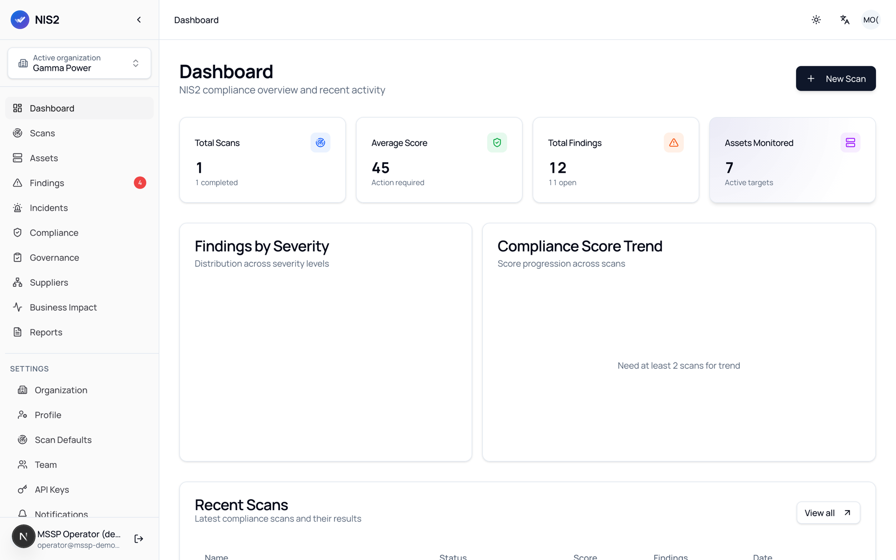

<p align="center">
  
  <br />
  
  
  
  
</p>

<p align="center">
  
</p>

<p align="center">
  ▶️ <b>Watch the 2-min demo:</b>
  <a href="https://github.com/fabriziosalmi/nis2-public/releases/download/v2.6.0/nis2_demo_it.mp4">🇮🇹 Italiano</a> ·
  <a href="https://github.com/fabriziosalmi/nis2-public/releases/download/v2.6.0/nis2_demo_en.mp4">🇬🇧 English</a>
  &nbsp; | &nbsp;
  📄 <b>Sample NIS2 report (PDF/A):</b>
  <a href="https://github.com/fabriziosalmi/nis2-public/releases/download/v2.6.0/nis2_demo_report_IT.pdf">🇮🇹 IT</a> ·
  <a href="https://github.com/fabriziosalmi/nis2-public/releases/download/v2.6.0/nis2_demo_report_EN.pdf">🇬🇧 EN</a>
</p>

# NIS2 Continuous Posture Management and Remediation Platform

Open-source platform for **NIS2 Directive (EU 2022/2555) continuous posture management**. Governance framework, technical validation engine, remediation playbooks, incident response workflows, and supply chain risk management.

Designed for self-hosted, on-premise deployment. Your scan data, asset inventory, and vulnerability reports never leave your infrastructure.

> For CISO, DPO, NIS2 consultants, and IT teams bridging the gap between compliance documentation and operational execution.

---

## Ecosystem

Part of the [CertMate](https://github.com/fabriziosalmi/certmate) ecosystem for TLS / certificate operations and EU compliance:

- **[CertMate](https://github.com/fabriziosalmi/certmate)** — open-source SSL certificate management (API + UI).
- **[certmate-tools](https://github.com/fabriziosalmi/certmate-tools)** — free, privacy-first, client-side TLS / certificate / ACME diagnostics.
- **[certmate-agent](https://github.com/fabriziosalmi/certmate-agent)** — conversational assistant for CertMate (local LLM + REST API + RAG).

**Enterprise / high-scale** — multi-tenant, mTLS, white-label and NIS2-aligned TLS deployments are available through *CertMate-ng* (source-available, BSL 1.1, EU-built). Contact **fabrizio.salmi@gmail.com**.

---

## What this platform is (and is not)

This is **not** a scanner that calls itself a compliance platform. It's a GRC layer with an integrated technical validation engine. It does **not** replace a CISO, an internal audit programme, or a real legal review of your D.Lgs 138/2024 obligations.

| Layer | What it does |
|-------|--------------|
| **Governance Framework** | 30-item checklist cross-referenced to NIS2 Art. 21 sub-paragraphs, document tracking, owner assignment |
| **Remediation and Execution Control** | Structured playbooks, open/acknowledged/resolved workflow. An optional LLM copilot exists as an API endpoint (see below) but has no dashboard screen |
| **Technical Validation Engine** | 30+ automated checks (TLS, DNS, ports, certificates, headers, secrets) — the probe that verifies if the network reflects the policy |

The scanner is the technical probe. The governance framework is where the substantive NIS2 work lives — and most of it is human work, not automation.

---

## What is usable from the dashboard today

Read this before the feature tables below. Several modules exist as a working REST API but have **no write path in the web UI** — records must be created with `curl`, an API key, or the MCP tools. That is a real limitation for the audience this platform targets, and it is stated here rather than buried.

| Module | Dashboard | API |
|---|---|---|
| Assets, Scans, Findings, Reports | full read + write | full |
| Governance checklist (Art. 21) | full read + write | full |
| Organizations, members, API keys, audit log | full read + write | full |
| **Vendors / supply chain (Art. 18)** | **read-only** — inventory and scores display; vendors cannot be added or edited | full CRUD |
| **Business Impact Analysis** | **read-only** — matrix and gaps display; processes cannot be added or edited | full CRUD |
| **Incidents (Art. 23)** | **read-only** — the 24h/72h/1-month countdown is live, but incidents cannot be opened, updated or closed | full CRUD |
| **Notification channels** | **not implemented** — the settings screen is a non-functional placeholder that keeps channels in browser state and discards them | **no endpoint exists** |
| **CSIRT "Red Button"** | **no UI** | `POST /csirt/emergency` |
| **ACN export (Italy)** | **no UI** | `GET /acn-export/art18`, `/bia` |
| **Compliance deadline countdown** | **no UI** | `GET /deadlines` |
| **Deep certificate analysis** | **no UI** | `/certificates` (3 endpoints) |
| **AI remediation copilot** | **no UI** — findings show only the scanner's static remediation string | `POST /remediation/explain` |
| **TOTP MFA** | **no UI** — and enrolling via the API locks you out of the dashboard (see the warning under Art. 21) | `/auth/totp/setup\|verify\|disable` |

Two consequences worth being explicit about:

- **Art. 23 incident alerting does not work out of the box.** The Celery beat task that dispatches 24h/72h/1-month deadline alerts reads `NotificationChannel` rows, and there is no endpoint or screen that creates one — only a direct SQL `INSERT`. Without a row, the task falls back to emailing organisation admins, which requires `SMTP_*` to be configured. On a deployment with neither, the alert for a legally binding 24-hour deadline is written to the application log. The webhook (HMAC-SHA256) and Slack channels described below are implemented in the dispatcher but currently unreachable.
- **A consultant cannot run an Art. 18 or BIA engagement from the UI alone.** Both modules read data they give you no way to enter.

Contributions closing any of these gaps are welcome; they are the highest-value work in the project.

---

## NIS2 Directive coverage

### Art. 21 — Risk management measures

The compliance matrix references all ten sub-paragraphs (a) through (j). Several of them — by design of the directive itself — cannot be evaluated by an automated scanner and are tracked through the governance checklist (status: *manual verification required*). What the platform automates vs. what stays manual:

| Sub-paragraph | Scope | Implementation status | How the platform supports it |
|---------------|-------|-----------------------|------------------------------|
| (a) Risk analysis policies | Methodology, periodic updates | **Partial** — automated bridge from scanner findings | Governance checklist + `POST /governance/sync-risk` automatically escalates checklist items when HIGH/CRITICAL scanner findings are open; risk summary via `GET /governance/risk-summary` |
| (b) Incident handling | Detection, response, CSIRT notification | **Partial** — API complete, dashboard read-only, alerting needs manual setup | Incident module + Art. 23 lifecycle; Celery beat checks every 15 min and dispatches alerts at 24 h / 72 h / 1-month with Redis-backed dedup — but incidents can only be created through the API, and the notification channels the dispatcher reads have no endpoint that creates them (see [What is usable from the dashboard today](#what-is-usable-from-the-dashboard-today)) |
| (c) Business continuity | BCP, DRP, backup, periodic testing | **Partial** — API complete, dashboard read-only | BIA module (RTO/RPO/MTPD), impact scoring, gap detection. Processes must be created through the API; the dashboard only displays them |
| (d) Supply chain security | Vendor assessment, contracts, monitoring | **Partial** — API complete, dashboard read-only | Vendor Risk module (Art. 18) with documented 100-point scoring formula (certification, data access, audit recency, geography, security clauses); auditor-facing `GET /vendors/score-formula`. Vendors must be created through the API |
| (e) Secure acquisition and development | SDLC, code review, vulnerability management | **Partial** — scanner automates surface checks | Technical validation engine (TLS, headers, secrets, ports) + governance checklist for organisational controls |
| (f) Effectiveness assessment | Internal audits, KPIs, penetration testing | **Partial** — scan-driven | Technical validation engine + checklist |
| (g) Cyber hygiene and training | Awareness, phishing simulation | **Manual** | Governance checklist (human verification required by design) |
| (h) Cryptography | Crypto policy, key management | **Partial** — automated for public-facing TLS | Technical validation (TLS version, cipher suites, cert expiry, HSTS) + checklist for key-management policy |
| (i) Human resources security | Onboarding/offboarding, screening, PAM | **Manual** | Governance checklist (human verification required by design) |
| (j) Authentication and access control | MFA, RBAC, PAM, SSO, access logging | **Partial** — RBAC and access logging complete; **MFA is API-only and currently unusable** | Role-based access (owner/admin/auditor/viewer), per-request scoped API keys (`dual_auth_with_scope`), per-request audit log, RS256 JWT with `GET /.well-known/jwks.json` — all reachable from the dashboard. TOTP MFA exists as three endpoints (`POST /auth/totp/setup\|verify\|disable`) with **no dashboard screen at all** — see the warning below before enabling it |

> ### ⚠ Do not enable TOTP MFA on this release
>
> There is no MFA screen anywhere in the web application — no component and no
> translation key references TOTP, MFA or 2FA. Enrolment is possible only by
> calling `POST /api/v1/auth/totp/setup` and `/verify` directly.
>
> **Enrolling locks you out of the dashboard.** With MFA active, `POST /auth/login`
> returns `{"mfa_required": true, "partial": true}` and sets no session cookie.
> The login page does not inspect the response: it stores the (absent) user and
> redirects to `/dashboard`, which has no session, 401s, and bounces back to
> login — a loop with no way out. `POST /auth/totp/disable` requires an
> authenticated session, so recovery is only possible by completing the MFA login
> against the API and calling `/disable` from there.
>
> Art. 21(2)(j) explicitly concerns multi-factor authentication, so this gap is
> named rather than glossed. Until an MFA screen exists, treat MFA on this
> platform as not shipped.

**Legend**: *Implemented* = available end-to-end, dashboard included, with no manual step required. *Partial* = either the automated checks cover only the technically observable surface and organisational controls need human verification, or the capability exists in the API but not yet in the dashboard — the "How the platform supports it" column says which. *Manual* = the directive explicitly requires human judgement; automation cannot substitute.

### Art. 23 — Incident reporting (CSIRT)

Incident lifecycle aligned with the legal deadlines:

| Phase | Deadline | Platform support | Reachable from |
|-------|----------|------------------|----------------|
| Early Warning | 24 hours | "Red Button" generates a CSIRT-ready Early Warning JSON; alert 2 h before / on breach | API only (`POST /csirt/emergency`) |
| Incident Notification | 72 hours | Structured taxonomy, IOCs, timeline; alert 2 h before / on breach | API only (`POST /incidents`) |
| Final Report | 1 month | Aggregated data, impact assessment, lessons learned; alert 2 h before / on breach | API only |
| Live countdown across open incidents | — | 24h / 72h / 1-month clocks, per incident | **Dashboard** (read-only) |

> **Read this before relying on the alerting.** The deadline monitor runs every 15 minutes and dispatches through `NotificationChannel` rows — and **no endpoint or screen creates those rows**; only a direct SQL `INSERT` does. With none configured the task falls back to emailing organisation admins, which needs `SMTP_*` set. With neither, the alert for a legally binding 24-hour deadline goes to the application log. The webhook (HMAC-SHA256 signed) and Slack transports are implemented in the dispatcher but currently unreachable.
>
> Incidents themselves are created, updated and closed **through the API**; the dashboard displays them and their countdowns but cannot open one.
>
> **Submission to CSIRT Italia is a manual step** through `csirt.gov.it`. There is no automated push to the CSIRT portal.

### Art. 18 — Supply chain (Vendor Risk Management)

> **Dashboard is read-only.** Every field below is a working API capability; vendors must be created and edited through `POST`/`PATCH /vendors`. The dashboard renders the inventory, the scores and the ACN flags but offers no form.

| Feature | API | Dashboard |
|---------|-----|-----------|
| Vendor inventory with criticality classification (1-4) | Implemented | read-only |
| Security assessment scoring (0-100) | Implemented | read-only |
| Contract tracking (SLA, audit rights, security clauses) | Implemented | read-only |
| Geographic location and data access level | Implemented | read-only |
| Certification tracking (ISO 27001, SOC2, CSA STAR) | Implemented | read-only |
| ACN Art. 18 relevance flagging (Italy) | Implemented | read-only |

### Business Impact Analysis (BIA)

> **Dashboard is read-only**, same as Art. 18 above: processes are created through `POST /bia`, and the dashboard renders the matrix and the detected gaps.

| Feature | API | Dashboard |
|---------|-----|-----------|
| Business process inventory with criticality levels | Implemented | read-only |
| RTO/RPO/MTPD definition per process | Implemented | read-only |
| 5-dimension impact scoring (financial, operational, reputational, regulatory, safety) | Implemented | read-only |
| Asset and vendor dependency mapping | Implemented | read-only |
| BCP/DRP gap detection | Implemented | read-only |
| Impact matrix with automatic gap identification | Implemented | read-only |

---

## National transposition modules

The NIS2 Directive requires each EU member state to transpose it into national law. This platform provides a reference implementation for Italy, extensible to other jurisdictions.

### Italy: D.Lgs 138/2024 + Determine ACN

| Reference | Coverage |
|-----------|----------|
| D.Lgs 138/2024 (Italian NIS2 transposition) | Art. 21 cross-reference in the governance checklist |
| Determina ACN 127434/2026 | Technical baseline references in the compliance matrix |
| Determina ACN 127437/2026 | Art. 18 vendor inventory with ACN-specific fields |
| ACN BIA template | Internal model in place; alignment to the official ACN model pending publication |
| Compliance deadlines API | Real countdowns: CSIRT referent (Dec 2026), 24h notification (Jan 2027), baseline measures (Jul 2027). **API only — `GET /deadlines`; no dashboard screen** |
| ACN-compatible JSON export | `/api/v1/acn-export/art18` and `/api/v1/acn-export/bia`. **API only — no export button in the dashboard** |

> **ACN export — preliminary schema.** The official *modello di categorizzazione* announced by ACN (publication expected May/June 2026 per the Tavolo NIS) has not been released yet. The current export is a best-effort structural mapping based on Determina 127437/2026; field names and shape will be re-validated and may change once the official template is published.

### Other EU member states (extensible)

The governance checklist maps to NIS2 Art. 21 at the EU level. National-specific modules (like the Italian ACN module) can be added for ANSSI (France), BSI (Germany), CCN-CERT (Spain) and others — contributions welcome.

---

## Deployment: designed for on-premise

> A CISO of an essential entity will not upload their vulnerability data to a third-party cloud. This platform is designed to run inside your perimeter.

### Prerequisites

| Tool | Why | Notes |
|---|---|---|
| **Docker** + **Docker Compose v2.20+** | Runs the API, web, scanner, postgres, redis, celery containers | `compose v2.20` is required for `--wait` on healthchecks (`make dev` / `make prod` rely on it) |
| **GNU Make** | Drives the standardised targets (`dev`, `prod`, `clean`, `test`, etc.) | Pre-installed on macOS / Linux. On Windows: install via Git Bash, WSL2, or Chocolatey |
| **Python 3.10+** on the host | Used by `make clean`, `make clean-all`, and `make test-*` (pytest) | Linux/macOS package manager works; on Windows install from python.org (the Microsoft Store stub at `%LOCALAPPDATA%\Microsoft\WindowsApps\python.exe` is **not** a real Python — disable that alias in Settings → Apps → Apps & Features → App execution aliases). The Makefile detects `python3` / `py` / `python` in that order. |
| **`openssl`** (or any random-bytes generator) | Generates `JWT_SECRET`, `POSTGRES_PASSWORD`, `NIS2_APP_PASSWORD` and `REDIS_PASSWORD` for production deploys | `openssl rand -base64 32` is the canonical recipe |

> The platform itself runs inside containers and pulls all its runtime deps from the images — Node, Postgres, Redis, the Python interpreter for the API, etc. The host-side prerequisites above only drive build / clean / test from the Makefile.

### Quick start

```bash
git clone https://github.com/fabriziosalmi/nis2-public.git
cd nis2-public
cp .env.example .env    # Generate real secrets — see comments inside
make prod               # Production: Caddy auto-HTTPS + all services

# Or development:
make dev                # http://localhost:8077 (UI) + http://localhost:8000/docs (API)
```

All data stays in your PostgreSQL instance. No telemetry, no external calls, no cloud dependencies.

### Production secrets

`make prod` runs a pre-flight check (`prod-preflight`) before bringing up the stack. If `.env` is missing or carries placeholder values for `POSTGRES_PASSWORD` / `JWT_SECRET` / `CORS_ORIGINS`, the target exits early with a self-contained error message describing the exact command to fix it. The minimum recipe to put `.env` into a runnable shape:

```bash
# Postgres password — any non-empty string; rotate before sharing infra
sed -i.bak 's|^POSTGRES_PASSWORD=.*$|POSTGRES_PASSWORD='$(openssl rand -base64 24)'|' .env

# JWT secret — must be ≥32 chars; the API refuses to start otherwise
sed -i.bak 's|^JWT_SECRET=.*$|JWT_SECRET='$(openssl rand -base64 32)'|' .env

# Runtime database role — must match the password embedded in DATABASE_URL.
# The API refuses to start on a superuser role, because Postgres bypasses RLS
# for one and tenant isolation would rest on app-level filters alone.
APP_PW=$(openssl rand -base64 24)
sed -i.bak "s|^NIS2_APP_PASSWORD=.*$|NIS2_APP_PASSWORD=${APP_PW}|" .env
sed -i.bak "s|CHANGE_ME_APP_ROLE_PASSWORD|${APP_PW}|g" .env

# Redis password
sed -i.bak 's|^REDIS_PASSWORD=.*$|REDIS_PASSWORD='$(openssl rand -base64 24)'|' .env

# CORS allow-list — comma-separated, no wildcards. Example:
sed -i.bak 's|^CORS_ORIGINS=.*$|CORS_ORIGINS=https://nis2.example.com|' .env

rm -f .env.bak
```

(macOS users: that's GNU `sed` syntax. For BSD `sed` drop the `.bak` argument or use a different editor — the goal is "replace the placeholder line with a real secret".)

**On the optional LLM copilot.** `POST /api/v1/remediation/explain` can call a local OpenAI-compatible server or OpenAI itself; OpenAI egress stays off unless `ENABLE_OPENAI=true`. Three caveats before planning around it:

- It has **no dashboard screen**. Findings display the scanner's static remediation string only.
- The shipped default `LLM_API_URL=http://localhost:1234/v1` is LM Studio's port (Ollama listens on 11434), and `localhost` *inside the API container* is that container — not your host. A local model server needs the container-reachable address, e.g. `http://host.docker.internal:11434/v1` on Docker Desktop.
- With `model: "auto"` the request sends the literal model name `default`, which LM Studio accepts and Ollama rejects. Pass a real model name for Ollama.

Finding text is interpolated into the prompt, and that text derives from content fetched from scanned third-party sites. Treat generated remediation commands as untrusted input to be reviewed, never as something to paste into a shell unread.

---

## Technical validation engine (30+ checks)

These automated checks verify whether the security measures documented in your governance framework are actually implemented on the network:

These checks run as part of a scan unless the table says otherwise. Read the right-hand column before quoting any of this to an auditor: several checks verify that a control is *present*, not that it is *correct*, and one whole category is not part of a scan at all.

| Category | Checks | What the check actually establishes |
|----------|--------|-------------------------------------|
| **TLS/SSL** | Negotiated protocol version and cipher; attempts TLS 1.0 / 1.1 handshakes; HSTS header present | The connection is made **without SNI** and with `check_hostname=False` / `CERT_OPTIONAL`, so against any shared IP, CDN or load balancer the server answers with its *default* certificate and the chain is not validated. Only the **negotiated** cipher is recorded — there is no cipher-suite enumeration. HSTS is checked for presence only, not `max-age` / `includeSubDomains`. On the shipped Debian bookworm image, OpenSSL's system-wide `SECLEVEL=2` refuses TLS < 1.2 client-side, so the weak-protocol probe cannot report a positive |
| **DNS security** | DNSSEC, SPF, DMARC, zone transfer (AXFR), MX redundancy | DNSSEC is inferred from the **presence of a DNSKEY record**; the parent DS record is not checked, so a signed-but-undelegated zone — the most common DNSSEC misconfiguration — reads as enabled |
| **HTTP headers** | CSP, HSTS, X-Frame-Options, cookie flags, SRI, security.txt | **Presence only.** `Content-Security-Policy: default-src *; script-src 'unsafe-inline'` passes. Cookie flags are matched as substrings of the raw `Set-Cookie`, so `SameSite=None` is indistinguishable from `SameSite=Strict`. SRI covers `<script src>` on external origins, not stylesheets |
| **Port exposure** | 14 critical ports (SSH, RDP, SMB, MySQL, PostgreSQL, Redis, MongoDB) | TCP reachability from the scanner's vantage point |
| **Resilience** | WAF/CDN detection, version disclosure | Header and cookie fingerprinting |
| **Secrets** | AWS keys, GitHub tokens, private keys, JWT in responses | Pattern matching over the first 1 MB of the response body |
| **Certificates** — chain validation, CT logs (crt.sh), OCSP, key strength, SAN coverage, expiry prediction, 0-100 health score | **not part of a scan** | This is the one genuinely deep analyser in the codebase, and `scanner.py` never calls it. It is reachable only through `POST /api/v1/certificates/check` and the MCP `check_certificate` tool — neither of which has a dashboard screen. Scans, reports and the compliance score do not include it |

> **CVSS scores in findings are fixed per check type**, not computed from the target's context, exposure or compensating controls. Treat them as severity labels, not as CVSS assessments.

### EU Privacy / GDPR Posture (separate from NIS2)

> These checks verify GDPR / ePrivacy / Consumer Code requirements. They are **not** NIS2 controls and are clearly labelled as such in all reports — never aggregated into the NIS2 score.

- P.IVA (Italian commercial website requirement)
- Privacy policy detection
- Cookie banner compliance (via Playwright)

---

## API surface

| Router | Endpoints | Purpose |
|--------|-----------|---------|
| `/api/v1/auth` | 13 | JWT authentication, registration, change-password, forgot/reset password, **switch active organization**, TOTP setup/verify/disable |
| `/api/v1/scans` | 8 | Scan management, results, comparison. Read endpoints accept API-key Bearer auth |
| `/api/v1/findings` | 5 | Finding lifecycle (open/acknowledged/resolved). Read endpoints accept API-key Bearer auth |
| `/api/v1/assets` | 6 | Asset inventory management. Read endpoints accept API-key Bearer auth |
| `/api/v1/api-keys` | 3 | Long-lived `nis2_*` Bearer tokens for CI/CD pipelines (raw value shown once) |
| `/api/v1/audit-logs` | 1 | Read-only org-scoped audit trail (90-day retention) |
| `/api/v1/organizations` | 8 | Org settings, members, role management, **self-serve org creation** |
| `/api/v1/vendors` | 5 | Vendor risk management (Art. 18). Dashboard read-only |
| `/api/v1/bia` | 5 | Business Impact Analysis. Dashboard read-only |
| `/api/v1/incidents` | 6 | Incident lifecycle (Art. 23 CSIRT). Dashboard read-only |
| `/api/v1/incident-monitor` | 2 | Art. 23 deadline monitor — live 24h/72h/1-month countdowns (drives the Incidents page) |
| `/api/v1/governance` | 8 | Art. 21 checklist, weighted score, `sync-risk` bridge, risk summary, by-subparagraph |
| `/api/v1/certificates` | 3 | Deep certificate analysis. No dashboard screen |
| `/api/v1/remediation` | 4 | Playbooks, AI copilot, cost estimation. No dashboard screen |
| `/api/v1/acn-export` | 2 | ACN-compatible JSON export (Italy, preliminary schema). No dashboard screen |
| `/api/v1/deadlines` | 1 | Compliance deadline countdown. No dashboard screen |
| `/api/v1/csirt/emergency` | 1 | "Red Button" — instant Early Warning payload. No dashboard button |
| `/api/v1/mcp` | 2 | Model Context Protocol for AI assistants |
| `/.well-known/jwks.json` | 1 | RS256 public key set for JWT verification |
| `/.well-known/security.txt` | 1 | Responsible disclosure contact |
| `/health`, `/health/live`, `/health/ready` | 3 | Three-tier liveness / readiness (DB + Redis + Celery) |

---

## Multi-tenant architecture

Designed for NIS2 consultants and DPO-as-a-service managing multiple clients:

- Organization-based data isolation (`organization_id` filter on every protected query, enforced by Postgres `FORCE ROW LEVEL SECURITY` policies — even the table owner cannot bypass them)
- RBAC: admin, auditor, viewer per organization
- **Org switcher in the sidebar** — a user with memberships in multiple orgs can move between client tenants without logging out (`POST /api/v1/auth/switch-org` remints the JWT with the new `org_id` claim, the FE clears the TanStack Query cache so no stale data leaks, audit log records the transition)
- **Self-serve org creation** — the switcher dropdown has a "Create new organization" footer entry that opens a dialog: enter a name, the API derives a unique slug, the user lands as `accepted_at`-stamped admin in the new tenant, and the FE auto-switches into it (`POST /api/v1/organizations`)
- Full **NIS2 dossier** report per client (PDF/HTML) — cover with score donut, "posture at a glance" hero, Art. 21 a–j coverage heatmap, plus governance / incidents / supply-chain / BIA / findings sections. Archival **PDF/A-2b**, tagged/accessible, embedded font, localized in all 5 languages
- Aggregated compliance dashboard across all organizations
- Each client's data stays in the same self-hosted instance

---

## Tech stack

| Layer | Technology |
|-------|-----------|
| **Frontend** | Next.js 15, React 19, shadcn/ui, Tailwind v4, Zustand, TanStack Query, Recharts, next-intl |
| **Backend** | FastAPI, SQLAlchemy (async), Pydantic v2, Celery, Redis, slowapi |
| **Database** | PostgreSQL 16 |
| **Scanner** | Python asyncio, aiohttp, dnspython, Playwright, python-whois |
| **Security** | CSP/HSTS/X-Frame-Options at the proxy and API layers, rate limiting (SlowAPI), SSRF prevention, API key auth, RS256 JWT + JWKS, Postgres RLS tenant isolation under a `NOSUPERUSER NOBYPASSRLS` role, audit log retention (90 days). TOTP MFA is API-only — see the Art. 21(2)(j) warning |
| **AI / MCP** | MCP Server (stdio + HTTP), Ollama/OpenAI |
| **Infra** | Docker, Caddy 2 (auto-HTTPS), GitHub Actions CI |

## Languages

| English | Italiano | Français | Deutsch | Español |
|---------|----------|----------|---------|---------|

945 translation keys per locale across 5 locales, at full parity — no locale is missing or
carrying an extra key. Cookie-based locale switching.

> The documentation site (`docs/`) exists in English and Italian only, so a German,
> French or Spanish user gets a fully localised application and no documentation in
> their language.

---

## Professional services

Platform developed and maintained by **Fabrizio Salmi**, independent NIS2 consultant.

| Service | Description |
|---------|-------------|
| **Private NIS2 scan** | White-label scan with executive report for the board |
| **Certificate remediation** | TLS/SSL lifecycle with CertMate and CertMate-NG |
| **NIS2 readiness assessment** | Gap analysis on all 10 Art. 21 sub-paragraphs |
| **Incident response** | CSIRT Art. 23 notification support, taxonomy, timeline |
| **Continuous monitoring** | Scheduled scans, trend analysis, quarterly reports |
| **Platform customization** | Private deploy, sector modules, SIEM/SOAR integration |
| **Training** | Board-level NIS2 overview, technical training for IT teams |

**Contact:** [fabrizio.salmi@gmail.com](mailto:fabrizio.salmi@gmail.com)

Related tools: [CertMate](https://github.com/fabriziosalmi/certmate) | CertMate-NG (private — [request access](mailto:fabrizio.salmi@gmail.com))

### Disclaimer — what the platform is *not*

The 30-item Art. 21 governance checklist shipped with the platform is a **community-curated didactic heuristic**, not a verbatim reproduction of the official ACN framework. The Italian National Cybersecurity Agency (Agenzia per la Cybersicurezza Nazionale — ACN) has translated the ten NIS2 risk-management measures into a NIST-derived control set detailed across multiple Determinazioni (e.g. Determina 127434/2026, 127437/2026, and follow-ups). The checklist included here is a **starting point** that maps to the ten Art. 21(2) sub-paragraphs at a high level and references the relevant ACN determinazioni; it does not, and is not intended to, replace a formal ACN-grade audit, a `Modello di Categorizzazione` filing, or any other regulatory deliverable.

The technical validation engine performs **automated checks on publicly-observable surface** (TLS, DNS, HTTP headers, port exposure, etc.) — these correspond to a subset of Art. 21(2)(h) "cryptography" and Art. 21(2)(e) "security in network and information systems acquisition" controls. They do **not** validate organisational controls (risk-management policies, incident-response procedures, supply-chain contracts, HR processes, training records, etc.) which by directive design require human verification.

This platform is a tool for governance and discovery, **not legal or compliance advice**. Engagement with a qualified NIS2 advisor and direct reference to ACN guidance remain mandatory for any production compliance posture.

## Legal & contact information

Operator identity, VAT (P.IVA), ATECO and the D.Lgs 70/2003 e-commerce disclosure are on the dedicated **[legal notice](docs/legal.md)**. Privacy — the GDPR Art. 13 information notice — is in **[docs/privacy.md](docs/privacy.md)**. Contact: [fabrizio.salmi@gmail.com](mailto:fabrizio.salmi@gmail.com).

> **Self-hosted deployments:** when you run this platform on your own infrastructure, **you become the data controller** under Art. 4(7) GDPR for the personal data processed by your instance (registered users, scan results, asset inventory, audit logs). The maintainer is not the data controller for self-hosted instances and provides no `informativa privacy` on your behalf. Adapt [docs/privacy.md](docs/privacy.md) to your deployment, publish it at a stable URL, and notify your users.

## License

AGPL-3.0 — see [LICENSE](LICENSE).

You can freely use, modify, and deploy this platform. If you modify it and offer it as a service to third parties, you must make your modifications available under the same license.

**Commercial license / dual licensing available for Enterprise.** If your organization needs a commercial license without copyleft obligations, contact [fabrizio.salmi@gmail.com](mailto:fabrizio.salmi@gmail.com).
